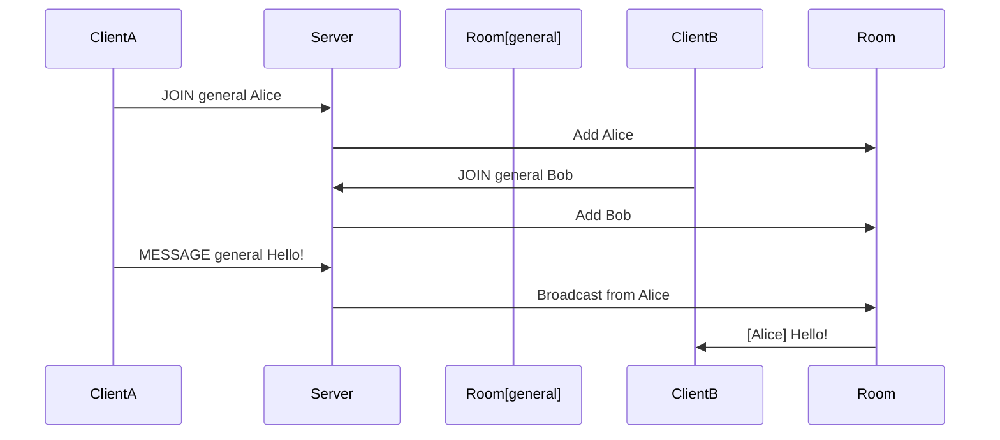

I’m embarking on a project that combines concurrency, state management, and networking fundamentals: a chat application where users can join named rooms and exchange messages in real time.

The server is multi-threaded, meaning it can handle many clients at once without blocking, and each client interaction runs in its own thread. Shared resources like room lists and user data will be protected with proper synchronization mechanisms like mutexes or locks.





## Why this project?

To master socket programming through a text-based protocol.

To strengthen my understanding of multi-threaded systems and race condition mitigation.

To build something closer to real-world applications like Slack, IRC, or Discord.

## Key Concepts:

- Socket communication `(accept(), recv(), send())`

- Thread-per-client concurrency model

- Shared memory access and synchronization

- Protocol design and command parsing

By keeping the MVP simple and modular, I’ll leave room for adding stretch features like private messaging, a user list, or even a CLI interface.

This project is both a learning challenge and a practical demonstration of server-side design patterns. Updates coming soon.
