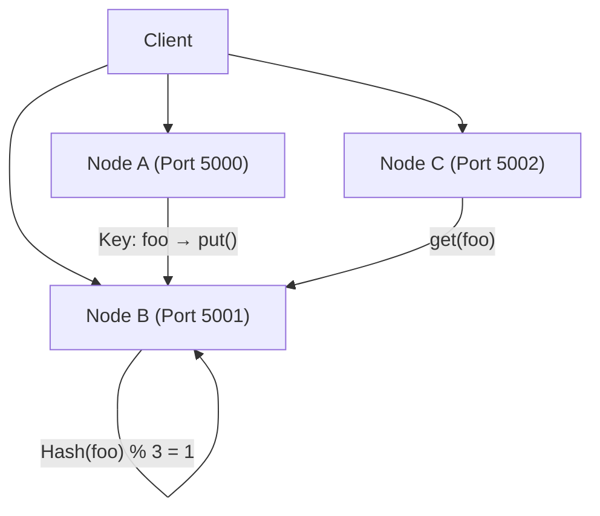

I’m building a simplified **distributed key-value store** that mimics how large-scale systems like Amazon DynamoDB or Apache Cassandra distribute and manage data across multiple nodes.

Each node acts as a small independent server with its own storage engine. Keys are assigned to nodes using a hash function, allowing for sharding and distributed storage. Communication between nodes happens over sockets.





## Why this project?

- To learn how distributed data systems route, replicate, and retrieve data.

- To implement inter-process communication between distributed nodes.

- To get hands-on experience with sharding, replication, and fault handling.

## Core Concepts:

- Socket communication between multiple servers

- Hash-based sharding: owner_node = hash(key) % num_nodes

- In-memory key-value storage (dict/map)

- Command-line client tools

## Planned Stretch Features:

- N-way replication for fault tolerance

- Heartbeat-based failure detection

- Eventual consistency with quorum-based read/write

This is the kind of backend infrastructure powering modern databases and cloud systems. By building it from scratch, I’m diving deep into distributed design and seeing the challenges firsthand.
